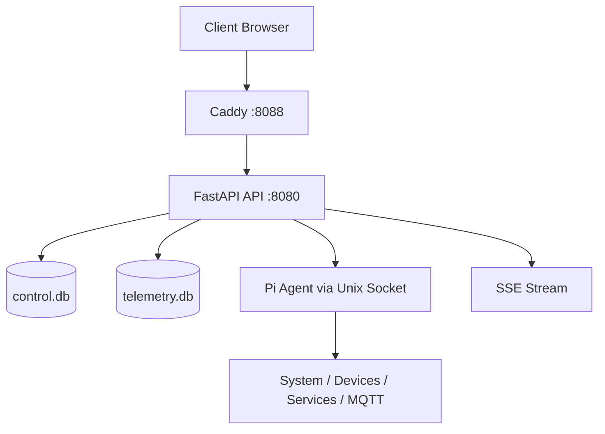

<a id="english"></a>

# Pi Control Panel

<p align="center">
  <strong>Language:</strong>
  <a href="#english">English (Default)</a> |
  <a href="#turkce">Turkce</a>
</p>

<p align="center">
  <strong>A modern, secure, operations-focused management panel for Raspberry Pi</strong><br/>
  FastAPI + React + Agent + Telemetry + Backup
</p>

<p align="center">
  
  
  
  
  
</p>

---

## Overview

Pi Control Panel is a production-ready web platform that lets you monitor and manage Raspberry Pi devices from a single interface.

- Real-time system telemetry (CPU, RAM, disk, temperature, load, RX/TX)
- systemd service management and core operational commands
- USB/Serial/IoT device discovery and control
- Browser-based terminal (with security layers)
- Alert rules, audit logs, archiving, and backups
- Local daily export and retention archiving flow

> Access model: `full` profile includes Tailscale setup for private remote access; `local` profile skips Tailscale entirely and serves the same panel on the LAN. Neither profile is intended for direct public internet exposure.

---

## Screenshots

<p align="center">
  
  
</p>
<p align="center">
  
  
</p>
<p align="center">
  
  
</p>
<p align="center">
  
  
</p>
<p align="center">
  
  
</p>

---

## Tech Stack

| Layer | Technologies |
|---|---|
| UI | React 18, Vite 5, Tailwind CSS, Recharts, Radix UI, XTerm |
| API | FastAPI, Uvicorn, Pydantic v2, aiosqlite, slowapi, SSE |
| Agent | Python-based system agent, Unix socket RPC, psutil, systemd, MQTT |
| Data | SQLite (`control.db`, `telemetry.db`) |
| Reverse Proxy | Caddy |
| Testing & Quality | Vitest, Testing Library, Pytest, Ruff, Black, MyPy, ESLint |
| Infrastructure | systemd services, full/local access profiles, script-based deployment |

---

## Architecture



Core flow:

1. UI is served through Caddy.
2. `/api/*` requests are proxied to FastAPI.
3. API handles DB, background jobs, agent RPC, and SSE streams.
4. Agent collects host-level system/device data and executes commands.

---

## Project Structure

```text
.
|-- panel/
|   |-- ui/                    # React + Vite frontend
|   `-- api/                   # FastAPI backend
|-- agent/                     # Pi agent (RPC, telemetry, providers)
|-- esp/                       # ESP32 example firmware files
|-- scripts/                   # Install, update, and verification scripts
|-- caddy/                     # Caddy config
|-- docs/                      # API, security, and operations docs
|-- install.sh                 # Native install on Pi
`-- deploy-native.sh           # One-command remote deploy
```

---

## Installation

### Local Installation (LAN only, no Tailscale)

Use this profile when the panel should run only inside the same local network. It installs the full Pi Control Panel stack, but it does not install, check, or prompt for Tailscale.

Direct install on a fresh Pi:

```bash
sudo apt update
sudo apt install -y git

git clone https://github.com/BGirginn/rasp_pi_webUI.git
cd rasp_pi_webUI

chmod +x install.sh
sudo ./install.sh --profile local
```

Remote deploy from Mac/Linux over LAN:

```bash
git clone https://github.com/BGirginn/rasp_pi_webUI.git
cd rasp_pi_webUI
./deploy-native.sh --profile local pi@<lan-ip>
```

After installation:

- UI: `http://<pi-ip>:8088`
- API health: `http://<pi-ip>:8088/api/health`
- Initial username: `admin`
- Initial password: `admin`
- Custom web port: `sudo ./install.sh --profile local --web-port <port>`

### Full Installation (Tailscale remote access)

Use this profile when the panel should also support private remote access through Tailscale. It installs the same application stack as local mode and includes the Tailscale setup flow.

Direct install on a Pi:

```bash
git clone https://github.com/BGirginn/rasp_pi_webUI.git
cd rasp_pi_webUI

chmod +x install.sh
sudo ./install.sh --profile full
```

Remote deploy from Mac/Linux:

```bash
git clone https://github.com/BGirginn/rasp_pi_webUI.git
cd rasp_pi_webUI
./deploy-native.sh --profile full pi@<tailscale-ip-or-lan-ip>
```

After installation:

- UI: `http://<pi-ip>:8088`
- API health: `http://<pi-ip>:8088/api/health`
- Initial username: `admin`
- Initial password: `admin`
- If Tailscale is not connected yet, run `sudo tailscale up`
- Custom web port: `sudo ./install.sh --profile full --web-port <port>`

Notes:

- `sudo ./install.sh` defaults to the `full` profile.
- `sudo ./install.sh --no-tailscale` is kept as a backwards-compatible alias for `--profile local`.
- The installer prints the exact connection link and initial login after a successful install.

---

## Local Development

### API (FastAPI)

```bash
cd panel/api
python3 -m venv .venv
source .venv/bin/activate
pip install -r requirements.txt
uvicorn main:app --host 0.0.0.0 --port 8080 --reload
```

### UI (React + Vite)

```bash
cd panel/ui
npm install
npm run dev -- --host 0.0.0.0 --port 5173
```

### Tests

```bash
# API
cd panel/api && pytest

# UI
cd panel/ui && npm test
```

---

## Configuration

Example env file: [`.env.example`](./.env.example)

Common variables:

| Variable | Default | Purpose |
|---|---|---|
| `DATABASE_PATH` | `/var/lib/pi-control/control.db` | Main app database |
| `TELEMETRY_DB_PATH` | `/var/lib/pi-control/telemetry.db` | Telemetry database |
| `AGENT_SOCKET` | `/run/pi-agent/agent.sock` | API-Agent RPC socket path |
| `JWT_SECRET_FILE` | `/etc/pi-control/jwt_secret` | JWT secret file |
| `API_DEBUG` | `false` | Enables debug and docs |
| `WEB_PORT` | `8088` | Caddy web UI port used by install/check scripts |
| `PANEL_ALLOW_LAN` | `false` | LAN access mode |
| `BACKUP_DAILY_EXPORT_HOUR` | `0` | Daily export hour |
| `BACKUP_DAILY_EXPORT_MINUTE` | `5` | Daily export minute |

Default admin at first startup:

- username: `admin`
- password: `admin`

Override default password during install:

```bash
sudo DEFAULT_ADMIN_PASSWORD='a-strong-password' ./install.sh --profile local
```

---

## Operations and Maintenance

```bash
# Service status
sudo systemctl status pi-control
sudo systemctl status pi-agent
sudo systemctl status caddy

# Logs
sudo journalctl -u pi-control -f
sudo journalctl -u pi-agent -f
sudo journalctl -u caddy -f

# Service restart
sudo systemctl restart pi-control
sudo systemctl restart pi-agent
sudo systemctl restart caddy

# Update flow
sudo ./scripts/update.sh
```

Note: Google Drive backup integration is temporarily disabled.

---

## Latest Update Notes

**Current date:** 2026-03-27

- Improved metric selection/filter flow in telemetry history.
- Added stabilizations to reduce unnecessary UI resets during live metric refresh.
- Refined category-based styling in Devices and strengthened dedupe behavior for repeated records.
- Improved resilience in API background service startup and logging flows.
- Simplified and accelerated install/update scripts for operational usage.
- Google Drive backup system is temporarily removed (local backup remains active).

---

## TODO

- [ ] Re-enable Google Drive backup integration with a new flow.

---

## Troubleshooting

```bash
# Is API up?
curl -s http://127.0.0.1:8080/api/health

# Last 100 logs
sudo journalctl -u pi-control -n 100 --no-pager

# Validate Caddy config
sudo caddy validate --config /etc/caddy/Caddyfile
```

If dashboard is not accessible:

1. Verify services with `sudo systemctl status pi-control caddy`.
2. Test `http://<pi-ip>:8088/api/health`.
3. For full profile, check `tailscale status`; for local profile, confirm your browser is on the same LAN as the Pi.

---

## License

MIT License - see [LICENSE](./LICENSE) for details.

<a id="turkce"></a>

# Pi Control Panel (Turkce)

<p align="center">
  <strong>Dil:</strong>
  <a href="#english">English (Varsayilan)</a> |
  <a href="#turkce">Turkce</a>
</p>

<p align="center">
  <strong>Raspberry Pi icin modern, guvenli ve operasyon odakli yonetim paneli</strong><br/>
  FastAPI + React + Agent + Telemetry + Backup
</p>

<p align="center">
  
  
  
  
  
</p>

---

## Genel Bakis

Pi Control Panel, Raspberry Pi cihazlarini tek noktadan izlemenizi ve yonetmenizi saglayan production-ready bir web platformudur.

- Gercek zamanli sistem telemetrisi (CPU, RAM, disk, sicaklik, load, RX/TX)
- systemd servis yonetimi ve temel operasyon komutlari
- USB/Serial/IoT cihaz kesfi ve kontrolu
- Tarayici uzerinden terminal (guvenlik katmanlariyla)
- Alarm kurallari, audit izleri, arsiv ve yedekleme
- Lokal gunluk export ve retention arsivleme akisi

> Erisim modeli: `full` profili ozel uzak erisim icin Tailscale kurulumunu dahil eder; `local` profili Tailscale'i tamamen atlar ve ayni paneli LAN uzerinde servis eder. Iki profil de dogrudan public internet acilimi icin tasarlanmamistir.

---

## Ekran Goruntuleri

<p align="center">
  
  
</p>
<p align="center">
  
  
</p>
<p align="center">
  
  
</p>
<p align="center">
  
  
</p>
<p align="center">
  
  
</p>

---

## Teknoloji Yigini

| Katman | Teknolojiler |
|---|---|
| UI | React 18, Vite 5, Tailwind CSS, Recharts, Radix UI, XTerm |
| API | FastAPI, Uvicorn, Pydantic v2, aiosqlite, slowapi, SSE |
| Agent | Python tabanli sistem agenti, Unix socket RPC, psutil, systemd, MQTT |
| Veri | SQLite (`control.db`, `telemetry.db`) |
| Reverse Proxy | Caddy |
| Test ve Kalite | Vitest, Testing Library, Pytest, Ruff, Black, MyPy, ESLint |
| Altyapi | systemd servisleri, full/local erisim profilleri, script tabanli deployment |

---

## Mimari


Temel calisma modeli:

1. UI, Caddy uzerinden servis edilir.
2. `/api/*` istekleri FastAPI'ye proxylenir.
3. API; DB, background joblar, agent RPC ve SSE akislarini yonetir.
4. Agent, host seviyesinde cihaz/servis/sistem bilgilerini toplar ve komut uygular.

---

## Proje Yapisi

```text
.
|-- panel/
|   |-- ui/                    # React + Vite frontend
|   `-- api/                   # FastAPI backend
|-- agent/                     # Pi agent (RPC, telemetry, providers)
|-- esp/                       # ESP32 ornek firmware dosyalari
|-- scripts/                   # Kurulum, guncelleme, dogrulama scriptleri
|-- caddy/                     # Caddy config
|-- docs/                      # API, guvenlik ve operasyon dokumanlari
|-- install.sh                 # Pi uzerinde native kurulum
`-- deploy-native.sh           # Uzak hosta tek komut deploy
```

---

## Kurulum

### Local Kurulum (sadece LAN, Tailscale yok)

Panel sadece ayni yerel ag icinde calisacaksa bu profili kullanin. Tum Pi Control Panel stack'i kurulur, ancak Tailscale kurulmaz, kontrol edilmez ve Tailscale icin prompt verilmez.

Sifir Pi uzerinde dogrudan kurulum:

```bash
sudo apt update
sudo apt install -y git

git clone https://github.com/BGirginn/rasp_pi_webUI.git
cd rasp_pi_webUI

chmod +x install.sh
sudo ./install.sh --profile local
```

Mac/Linux uzerinden LAN ile uzak deploy:

```bash
git clone https://github.com/BGirginn/rasp_pi_webUI.git
cd rasp_pi_webUI
./deploy-native.sh --profile local pi@<lan-ip>
```

Kurulum sonrasi:

- UI: `http://<pi-ip>:8088`
- API health: `http://<pi-ip>:8088/api/health`
- Ilk kullanici adi: `admin`
- Ilk sifre: `admin`
- Ozel web portu: `sudo ./install.sh --profile local --web-port <port>`

### Full Kurulum (Tailscale ile uzak erisim)

Panel Tailscale uzerinden ozel uzak erisim de desteklesin istiyorsaniz bu profili kullanin. Local profil ile ayni uygulama stack'i kurulur ve ek olarak Tailscale kurulum akisi dahil edilir.

Pi uzerinde dogrudan kurulum:

```bash
git clone https://github.com/BGirginn/rasp_pi_webUI.git
cd rasp_pi_webUI

chmod +x install.sh
sudo ./install.sh --profile full
```

Mac/Linux uzerinden uzak deploy:

```bash
git clone https://github.com/BGirginn/rasp_pi_webUI.git
cd rasp_pi_webUI
./deploy-native.sh --profile full pi@<tailscale-ip-veya-lan-ip>
```

Kurulum sonrasi:

- UI: `http://<pi-ip>:8088`
- API health: `http://<pi-ip>:8088/api/health`
- Ilk kullanici adi: `admin`
- Ilk sifre: `admin`
- Tailscale bagli degilse `sudo tailscale up` calistirin
- Ozel web portu: `sudo ./install.sh --profile full --web-port <port>`

Notlar:

- `sudo ./install.sh` varsayilan olarak `full` profilini kullanir.
- `sudo ./install.sh --no-tailscale`, geriye uyumluluk icin `--profile local` alias'i olarak kalir.
- Basarili kurulumdan sonra installer terminalde net baglanti linkini ve ilk giris bilgisini yazar.

---

## Yerel Gelistirme

### API (FastAPI)

```bash
cd panel/api
python3 -m venv .venv
source .venv/bin/activate
pip install -r requirements.txt
uvicorn main:app --host 0.0.0.0 --port 8080 --reload
```

### UI (React + Vite)

```bash
cd panel/ui
npm install
npm run dev -- --host 0.0.0.0 --port 5173
```

### Testler

```bash
# API
cd panel/api && pytest

# UI
cd panel/ui && npm test
```

---

## Konfigurasyon

Ornek env dosyasi: [`.env.example`](./.env.example)

Sik kullanilan degiskenler:

| Degisken | Varsayilan | Amac |
|---|---|---|
| `DATABASE_PATH` | `/var/lib/pi-control/control.db` | Ana uygulama veritabani |
| `TELEMETRY_DB_PATH` | `/var/lib/pi-control/telemetry.db` | Telemetry veritabani |
| `AGENT_SOCKET` | `/run/pi-agent/agent.sock` | API-Agent RPC socket yolu |
| `JWT_SECRET_FILE` | `/etc/pi-control/jwt_secret` | JWT secret dosyasi |
| `API_DEBUG` | `false` | Debug ve docs aktivasyonu |
| `WEB_PORT` | `8088` | Install/check scriptlerinin kullandigi Caddy web UI portu |
| `PANEL_ALLOW_LAN` | `false` | LAN erisim modu |
| `BACKUP_DAILY_EXPORT_HOUR` | `0` | Gunluk export saati |
| `BACKUP_DAILY_EXPORT_MINUTE` | `5` | Gunluk export dakikasi |

Ilk acilista varsayilan admin:

- kullanici: `admin`
- sifre: `admin`

Kurulumda sifre override:

```bash
sudo DEFAULT_ADMIN_PASSWORD='guclu-bir-sifre' ./install.sh --profile local
```

---

## Operasyon ve Bakim

```bash
# Servis durumlari
sudo systemctl status pi-control
sudo systemctl status pi-agent
sudo systemctl status caddy

# Loglar
sudo journalctl -u pi-control -f
sudo journalctl -u pi-agent -f
sudo journalctl -u caddy -f

# Servis restart
sudo systemctl restart pi-control
sudo systemctl restart pi-agent
sudo systemctl restart caddy

# Guncelleme akisi
sudo ./scripts/update.sh
```

Not: Google Drive backup entegrasyonu gecici olarak devre disidir.

---

## Son Guncelleme Notlari

**Guncel tarih:** 2026-03-27

- Telemetry history ekraninda metrik bazli secim/filtre akisi iyilestirildi.
- Canli metrik yenilemelerinde gereksiz UI resetlerini azaltan stabilizasyonlar eklendi.
- Devices ekraninda kategori tabanli stil yapisi netlestirildi ve tekrar eden kayitlara karsi dedupe mantigi guclendirildi.
- API tarafinda background servis baslatma ve loglama akislarinda dayaniklilik artirildi.
- Kurulum/guncelleme scriptleri operasyonel kullanim icin sadelestirildi ve hizlandirildi.
- Google Drive backup sistemi gecici olarak kaldirildi (local backup aktif).

---

## TODO

- [ ] Google Drive backup entegrasyonunu yeni akisla tekrar devreye almak.

---

## Sorun Giderme

```bash
# API ayakta mi?
curl -s http://127.0.0.1:8080/api/health

# Son 100 log
sudo journalctl -u pi-control -n 100 --no-pager

# Caddy config dogrulama
sudo caddy validate --config /etc/caddy/Caddyfile
```

Dashboard acilmiyorsa:

1. `sudo systemctl status pi-control caddy` ile servis durumlarini dogrulayin.
2. `http://<pi-ip>:8088/api/health` yanitini test edin.
3. Full profilde `tailscale status` kontrol edin; local profilde tarayicinin Pi ile ayni LAN'da oldugunu dogrulayin.

---

## Lisans

MIT License - detaylar icin [LICENSE](./LICENSE).
