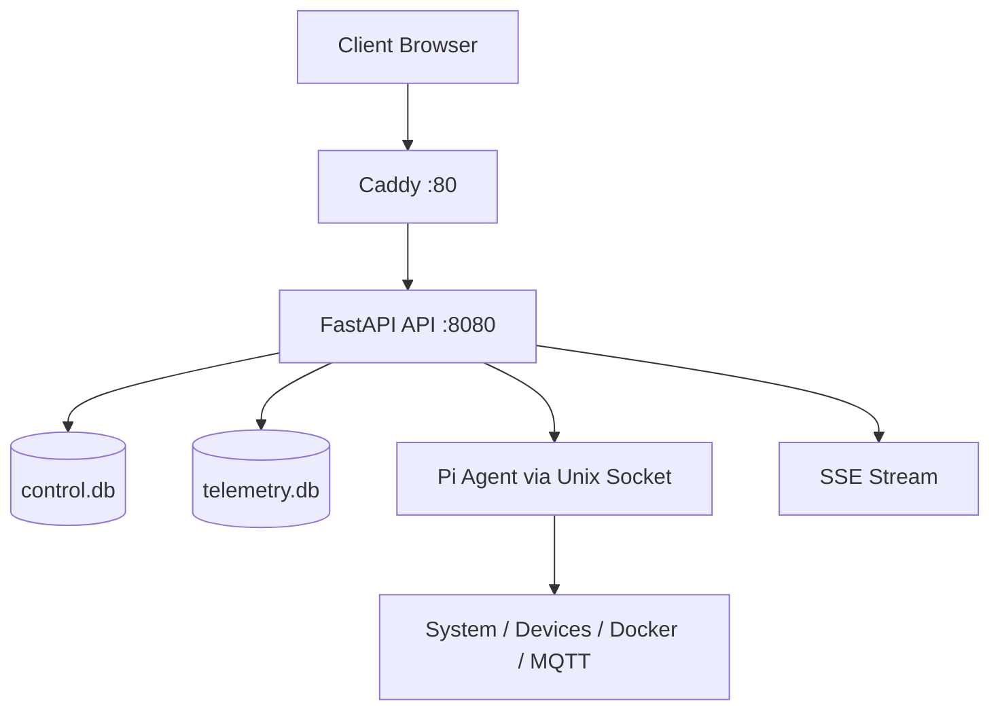

# Pi Control Panel

<p align="center">
  <strong>Raspberry Pi icin modern, guvenli ve operasyon odakli yonetim paneli</strong><br/>
  FastAPI + React + Agent + Telemetry + Backup
</p>

<p align="center">
  
  
  
  
  
</p>

---

## Genel Bakis

Pi Control Panel, Raspberry Pi cihazlarini tek noktadan izlemenizi ve yonetmenizi saglayan production-ready bir web platformudur.

- Gercek zamanli sistem telemetrisi (CPU, RAM, disk, sicaklik, load, RX/TX)
- systemd servis yonetimi ve temel operasyon komutlari
- USB/Serial/IoT cihaz kesfi ve kontrolu
- Tarayici uzerinden terminal (guvenlik katmanlariyla)
- Alarm kurallari, audit izleri, arsiv ve yedekleme
- Lokal gunluk export ve retention arsivleme akisi

> Guvenlik modeli: varsayilan olarak Tailscale-first ve internete dogrudan acik degil.

---

## Ekran Goruntuleri

<p align="center">
  
  
</p>
<p align="center">
  
  
</p>
<p align="center">
  
  
</p>
<p align="center">
  
  
</p>
<p align="center">
  
  
</p>

---

## Teknoloji Yigini

| Katman | Teknolojiler |
|---|---|
| UI | React 18, Vite 5, Tailwind CSS, Recharts, Radix UI, XTerm |
| API | FastAPI, Uvicorn, Pydantic v2, aiosqlite, slowapi, SSE |
| Agent | Python tabanli sistem agenti, Unix socket RPC, psutil, docker, MQTT |
| Veri | SQLite (`control.db`, `telemetry.db`) |
| Reverse Proxy | Caddy |
| Test ve Kalite | Vitest, Testing Library, Pytest, Ruff, Black, MyPy, ESLint |
| Altyapi | systemd servisleri, Tailscale erisimi, script tabanli deployment |

---

## Mimari



Temel calisma modeli:

1. UI, Caddy uzerinden servis edilir.
2. `/api/*` istekleri FastAPI'ye proxylenir.
3. API; DB, background joblar, agent RPC ve SSE akislarini yonetir.
4. Agent, host seviyesinde cihaz/servis/sistem bilgilerini toplar ve komut uygular.

---

## Proje Yapisi

```text
.
|-- panel/
|   |-- ui/                    # React + Vite frontend
|   `-- api/                   # FastAPI backend
|-- agent/                     # Pi agent (RPC, telemetry, providers)
|-- esp/                       # ESP32 ornek firmware dosyalari
|-- scripts/                   # Kurulum, guncelleme, dogrulama scriptleri
|-- caddy/                     # Caddy config
|-- docs/                      # API, guvenlik ve operasyon dokumanlari
|-- install.sh                 # Pi uzerinde native kurulum
`-- deploy-native.sh           # Uzak hosta tek komut deploy
```

---

## Kurulum

### 1) Uzak Deployment (Mac/Linux -> Pi)

```bash
git clone https://github.com/BGirginn/rasp_pi_webUI.git
cd rasp_pi_webUI
./deploy-native.sh pi@<tailscale-ip-veya-lan-ip>
```

Bu akista script:

- SSH baglantisini test eder
- proje dosyalarini rsync ile hedefe tasir
- hedefte `install.sh` calistirir
- API health kontrolu yapar

### 2) Pi Uzerinde Dogrudan Kurulum

```bash
git clone https://github.com/BGirginn/rasp_pi_webUI.git
cd rasp_pi_webUI
chmod +x install.sh
sudo ./install.sh
```

Sik kullanilan opsiyonlar:

```bash
sudo ./install.sh --skip-preflight
sudo ./install.sh --no-tailscale
sudo ./install.sh --upgrade
```

Kurulum sonrasi:

- UI: `http://<pi-ip>`
- API health: `http://<pi-ip>/api/health`
- API docs (debug aciksa): `http://<pi-ip>/api/docs`

---

## Yerel Gelistirme

### API (FastAPI)

```bash
cd panel/api
python3 -m venv .venv
source .venv/bin/activate
pip install -r requirements.txt
uvicorn main:app --host 0.0.0.0 --port 8080 --reload
```

### UI (React + Vite)

```bash
cd panel/ui
npm install
npm run dev -- --host 0.0.0.0 --port 5173
```

### Testler

```bash
# API
cd panel/api && pytest

# UI
cd panel/ui && npm test
```

---

## Konfigurasyon

Ornek env dosyasi: [`.env.example`](./.env.example)

Sik kullanilan degiskenler:

| Degisken | Varsayilan | Amac |
|---|---|---|
| `DATABASE_PATH` | `/var/lib/pi-control/control.db` | Ana uygulama veritabani |
| `TELEMETRY_DB_PATH` | `/var/lib/pi-control/telemetry.db` | Telemetry veritabani |
| `AGENT_SOCKET` | `/run/pi-agent/agent.sock` | API-Agent RPC socket yolu |
| `JWT_SECRET_FILE` | `/etc/pi-control/jwt_secret` | JWT secret dosyasi |
| `API_DEBUG` | `false` | Debug ve docs aktivasyonu |
| `PANEL_ALLOW_LAN` | `false` | LAN erisim modu |
| `BACKUP_DAILY_EXPORT_HOUR` | `0` | Gunluk export saati |
| `BACKUP_DAILY_EXPORT_MINUTE` | `5` | Gunluk export dakikasi |

Ilk acilista varsayilan admin:

- kullanici: `admin`
- sifre: `admin123`

Kurulumda sifre override:

```bash
sudo DEFAULT_ADMIN_PASSWORD='guclu-bir-sifre' ./install.sh
```

---

## Operasyon ve Bakim

```bash
# Servis durumlari
sudo systemctl status pi-control
sudo systemctl status pi-agent
sudo systemctl status caddy

# Loglar
sudo journalctl -u pi-control -f
sudo journalctl -u pi-agent -f
sudo journalctl -u caddy -f

# Servis restart
sudo systemctl restart pi-control
sudo systemctl restart pi-agent
sudo systemctl restart caddy

# Guncelleme akisi
sudo ./scripts/update.sh
```

Not: Google Drive backup entegrasyonu gecici olarak devre disidir.

---

## Son Guncelleme Notlari

**Guncel tarih:** 2026-03-27

- Telemetry history ekraninda metrik bazli secim/filtre akisi iyilestirildi.
- Canli metrik yenilemelerinde gereksiz UI resetlerini azaltan stabilizasyonlar eklendi.
- Devices ekraninda kategori tabanli stil yapisi netlestirildi ve tekrar eden kayitlara karsi dedupe mantigi guclendirildi.
- API tarafinda background servis baslatma ve loglama akislarinda dayaniklilik artirildi.
- Kurulum/guncelleme scriptleri operasyonel kullanim icin sadelestirildi ve hizlandirildi.
- Google Drive backup sistemi gecici olarak kaldirildi (local backup aktif).

---

## TODO

- [ ] Google Drive backup entegrasyonunu yeni akisla tekrar devreye almak.

---

## Sorun Giderme

```bash
# API ayakta mi?
curl -s http://127.0.0.1:8080/api/health

# Son 100 log
sudo journalctl -u pi-control -n 100 --no-pager

# Caddy config dogrulama
sudo caddy validate --config /etc/caddy/Caddyfile
```

Dashboard acilmiyorsa:

1. `tailscale status` ile baglantiyi kontrol edin.
2. `sudo systemctl status pi-control caddy` ile servis durumlarini dogrulayin.
3. `http://<pi-ip>/api/health` yanitini test edin.

---

## Lisans

MIT License - detaylar icin [LICENSE](./LICENSE).

---

## Not

Bu README proje deposundaki scriptler ve mevcut kod yapisiyla uyumlu olacak sekilde yeniden duzenlenmistir.
